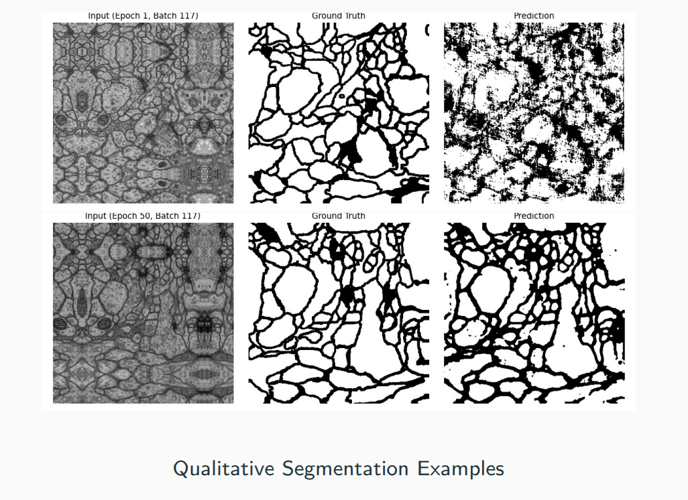
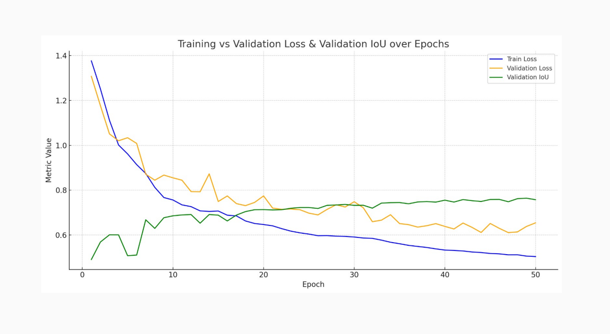

# 🧠 U-Net: Convolutional Networks for Biomedical Image Segmentation  

### CS/IT 308 - Machine Learning Project  
**Team Members:**  
- Manav Mehta (202252344)  
- Smit Shah (202251122)  
- Heet Shah (202251121)  
- Dhwanan Bharadva (202251028)  

**Professor:** Dr. Jignesh Bhatt  

---

## 📌 Problem Statement
- **Goal:** Develop a CNN for accurate biomedical image segmentation.  
- **Input:** Grayscale biomedical image `X ∈ R^(512×512×1)`  
- **Output:** Segmentation mask `Y ∈ R^(388×388×2)` with 2 classes per pixel.  
- **Challenges:**  
  - Limited labeled biomedical data  
  - Class imbalance  
  - High precision requirement  

**Applications:** Tumor detection, organ delineation, disease monitoring  

---

## 🗂️ Dataset
- **Type:** 2D grayscale biomedical images  
- **Source:** Transmission electron microscopy (Drosophila ventral nerve cord)  
- **Size:** 30 original images (512×512 pixels)  
- **Split:**  
  - Training Set: 930 augmented & annotated images  
  - Validation Set: 30 images  
  - Test Set: 30 images  

---

## ⚙️ Environment
- **Hardware:** NVIDIA Quadro GP100 (16GB VRAM, 34% Utilization)  
- **Language:** Python 3.9  
- **Framework:** PyTorch  

---

## 🏗️ U-Net Architecture
- Encoder-decoder structure with **5 convolutional + pooling / upsampling levels**  
- **Skip connections** with center cropping for size alignment  
- **Custom upsampling:** `Upsample + Conv2d`  
- **Weight Initialization:**  
  - Conv layers → Kaiming Normal  
  - Final layer → Uniform  

---

## 🔧 Training Details
- **Optimizer:** Stochastic Gradient Descent (SGD)  
  - Learning Rate: `2 × 10⁻⁵`  
  - Momentum: `0.99`  
- **Batch Size:**  
  - Train: 8  
  - Validation: 4  
- **Epochs:** 50  
- **Gradient Accumulation:** Every 4 steps (effective batch size 32)  
- **Validation Metric:** Intersection over Union (IoU)  

### 📉 Loss Function
- **Weighted Binary Cross-Entropy (BCE)** with inverse frequency class balancing  
- Handles **background-foreground imbalance**  

---

## 📊 Results

---

### 🔹 Training Progress (Epochs 1–50)
- Train Loss: **1.38 → 0.50**  
- Validation IoU: **0.49 → 0.76** (+55%)  
- IoU stabilized after **epoch 25**, peak **IoU > 0.75** at epochs 42–49  
- **Best Model:** Epoch 48  
  - Validation Loss: `0.614`  
  - Validation IoU: `0.762`  

---

### 🔹 Quantitative Test Set Evaluation
- **Intersection over Union (IoU):** `0.7576`  
- **Pixel Accuracy:** `0.8765`  
- **Loss (Weighted BCE):** `0.6544`  

---

## ✅ Conclusion
- Implemented **U-Net** achieves **robust segmentation performance** on biomedical images.  
- Combination of **U-Net + Mirror Padding + Weighted BCE Loss** proved highly effective.  
- Achieved **IoU: 0.7576**, **Accuracy: 87.65%** on unseen test data.  

---

## 📖 Reference
Ronneberger O., Fischer P., Brox T. (2015).  
**U-Net: Convolutional Networks for Biomedical Image Segmentation**.  
MICCAI 2015, LNCS, vol 9351. Springer.  
[Paper Link](https://arxiv.org/abs/1505.04597)  

---
